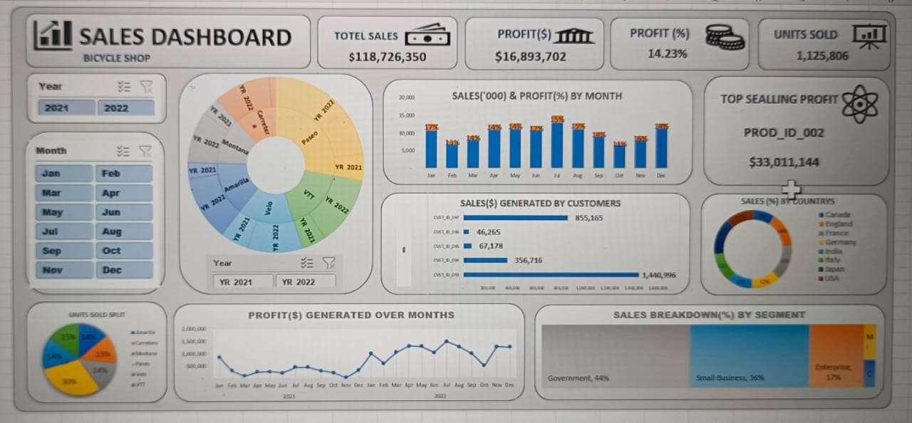

# 📊 Sales Dashboard – Excel Project

## 🧾 Project Overview
This project showcases a professional **Sales Dashboard** built using **Microsoft Excel** for a Bicycle Shop. It visualizes total sales, profits, customer-wise distribution, segment breakdown, and country-wise performance for the years 2021 and 2022.

## 🛠️ Tools Used
- Microsoft Excel  
  (Pivot Tables, Charts, Slicers, Conditional Formatting, Formulas)

## 🔍 Key Insights Visualized
- 📈 Total Sales: **$118,726,350**
- 💰 Total Profit: **$16,893,702**  
- 📊 Profit Percentage: **14.23%**
- 📦 Units Sold: **1,125,806**
- 🌍 Sales by Country and Segment
- 🧑‍🤝‍🧑 Sales Generated by Customers
- 📆 Monthly Sales and Profit Trends

## ✨ Features
- Interactive filtering by Year and Month
- Clean and modern dashboard layout
- Dynamic charts for easy interpretation
- Sunburst and pie charts for detailed breakdowns

## 👤 Created By
**Yamini Golla**

## 📂 Files in this Repository
- `Dynamic Sales Data_Dashboard.xlsx` – Main dashboard file
- `DASHBOARD.jpg` – Screenshot preview of the dashboard
- `README.md` – Project documentation

## 🚀 Future Scope
- Automate updates with Power Query or Python
- Expand to Power BI for more interactivity
- Add KPI indicators and forecasting

## 📬 Contact
Feel free to connect or reach out for feedback, collaborations, or questions!

---
